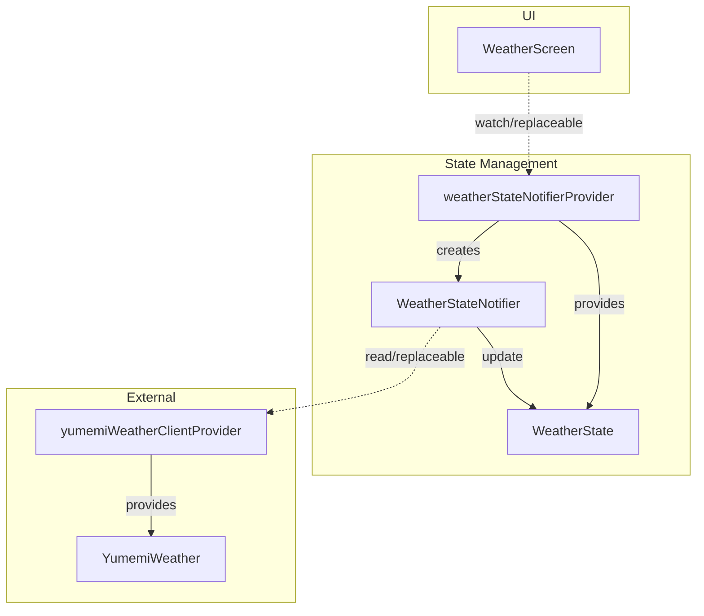
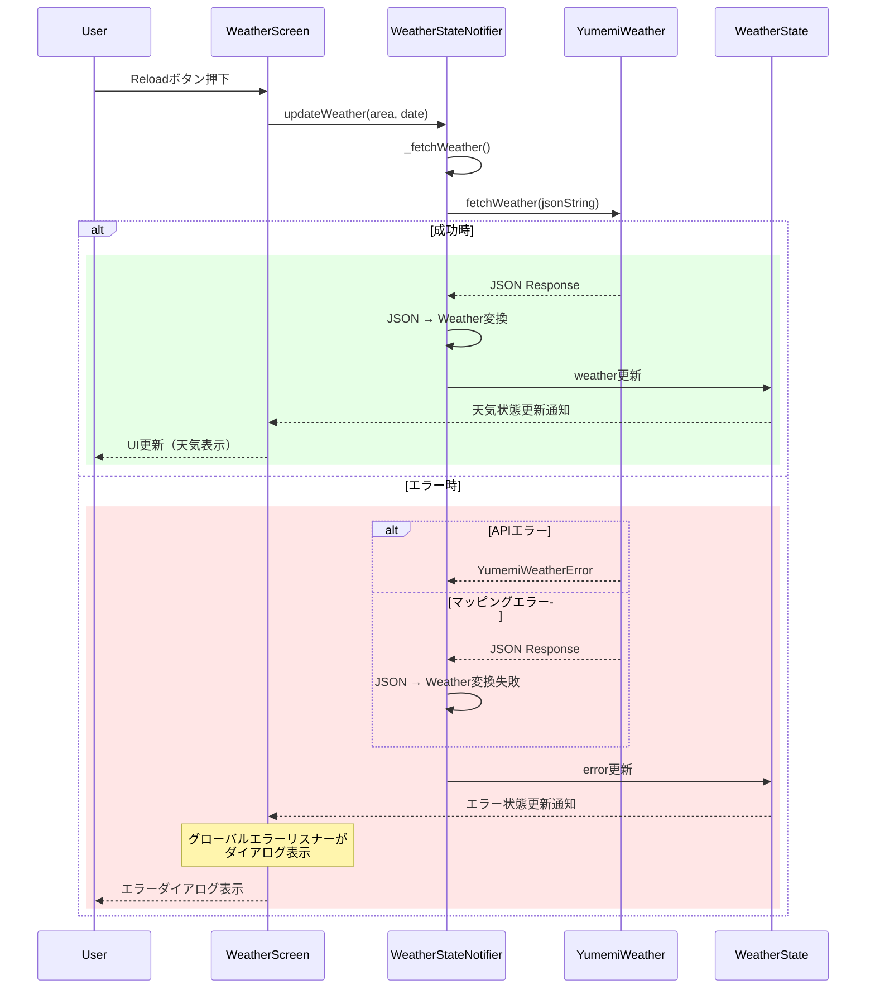

## コンポーネント図

## シーケンス図

### 天気情報更新フロー

## 各モジュールの機能

| モジュール | 責務 |
|---|---|
| **UI/Screen** |
| `WeatherScreen` | 天気情報の表示とユーザー操作の受付 |
| **UI/Widget** |
| `WeatherConditionWidget` | 天気状態のアイコン表示 |
| `WeatherTemperatureWidget` | 最高・最低気温の表示 |
| `GreenWidget` | 初期(緑)画面を表示し、遅延後に`WeatherScreen`に遷移|
| **UI/Providers** |
| `weatherStateNotifierProvider` | `WeatherStateNotifier`と`WeatherState`の提供 |
| `yumemiWeatherClientProvider` | `YumemiWeather`のDI提供 |
| **UI/Notifiers** |
| `WeatherStateNotifier` | 天気情報の取得・状態更新・エラーハンドリング |
| `WeatherState` | 天気情報とエラー状態を保持する不変データクラス |
| **Core/Entity** |
| `Weather` | アプリ内部の天気データ |
| `WeatherCondition` | 天気状態の列挙型 |
| **Core/Request** |
| `WeatherGetRequest` | APIリクエストデータの構造化 |
| **Core/Response** |
| `WeatherGetResponse` | APIレスポンスデータの構造化 |
| **Core/Bootstrap** |
| `install_error_listener.dart` | グローバルエラーリスナーの設定 |
