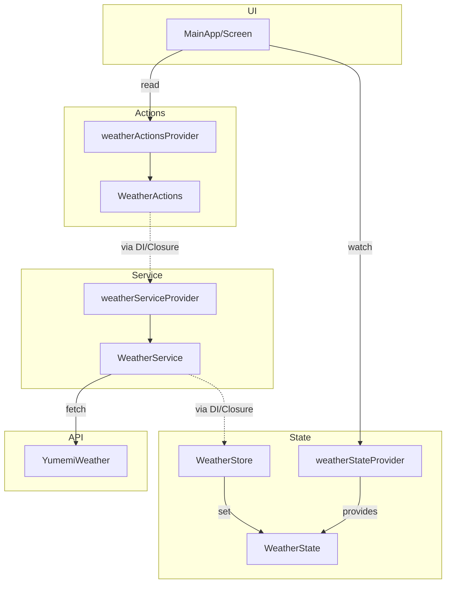
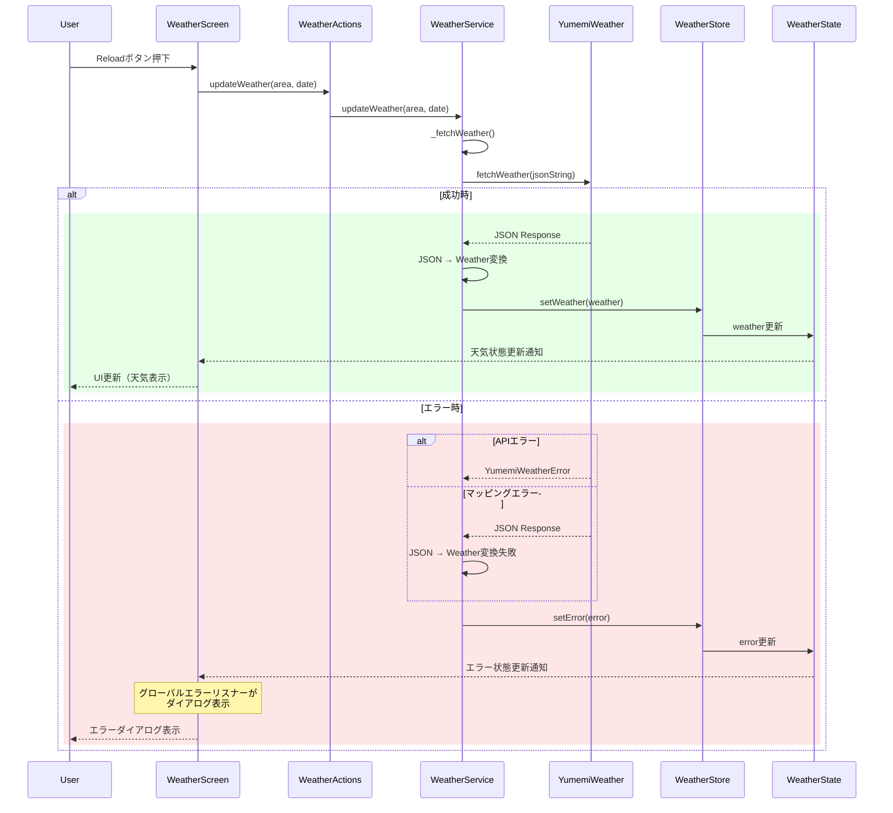

## コンポーネント図

## シーケンス図

### 天気情報更新フロー

## 各モジュールの機能

| モジュール | 責務 |
|---|---|
| **UI/Screen** |
| `WeatherScreen` | 天気情報の表示とユーザー操作の受付 |
| **UI/Widget** |
| `WeatherConditionWidget` | 天気状態のアイコン表示 |
| `WeatherTemperatureWidget` | 最高・最低気温の表示 |
| `GreenWidget` | 初期(緑)画面を表示し、遅延後に`WeatherScreen`に遷移|
| **UI/State** |
| `weatherStateProvider` | `WeatherState`の提供 |
| `WeatherStore` | `WeatherState`の変更操作 |
| `WeatherState` | 天気情報とエラー状態を保持 |
| **UI/Actions** |
| `weatherActionsProvider` | `WeatherActions`の提供 |
| `WeatherActions` | UI操作の抽象化を保持 |
| **Services/Service** |
| `weatherServiceProvider` | `WeatherStore`のメソッドをDIした`WeatherService`を提供 |
| `WeatherService` | API呼び出しとエラーハンドリングを行い、その結果に応じてクロージャを実行する |
| **Services/Request** |
| `WeatherGetRequest` | APIリクエストデータの構造化 |
| **Services/Response** |
| `WeatherGetResponse` | APIレスポンスデータの構造化 |
| **Services/Entity** |
| `Weather` | アプリ内部の天気データ |
| `WeatherCondition` | 天気状態の列挙型 |
| **Core/Bootstrap** |
| `install_error_listener.dart` | グローバルエラーリスナーの設定 |
| **Core/DI** |
| `overrides.dart` | `WeatherActions`に`WeatherService`のメソッドをDI |
